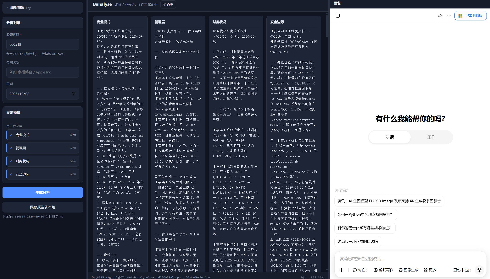

# Banalyse

以 [FinRobot](../FinRobot-master) 的业务蓝本（多章节股权研究/企业分析报告），
用 **LangGraph / LangChain** 重写编排层的多智能体企业分析工具。

使用：
cd  Banalyse                  # 在项目目录
python -m banalyse.web        # 或： banalyse serve
# 打开 http://127.0.0.1:8000

#

> 面向「国内外双市场、数据供应商可插拔」。

## 目录分层（依赖单向向下）

```
cli        →  graph  →  agents  →  domain / dataflows  →  llm_clients
展示层        编排层     智能体层        领域/数据层            基础设施层
```

铁律：`agents` 只依赖 `dataflows`(工具) 与 `llm_clients`；`graph/nodes` 只依赖
`domain` 与 `dataflows`；内层禁止 import 外层。

## 运行（M0，无需 API key）

```bash
pip install -e .            # 或 pip install -r requirements.txt
python main.py              # 用 mock LLM 离线跑通可编译空图
pytest -q                   # 运行测试
```


默认落在项目目录下的 `.local\`，**自动跟随仓库所在盘**。要改到别处：

```powershell
# 方式1：改整个数据目录
$env:BA_HOME = 'D:\data\banalyse'
# 方式2：只改报告位置
$env:BA_RESULTS_DIR = 'D:\data\banalyse\logs'
# 方式3：只改网页配置位置
$env:BA_WEB_CONFIG = 'D:\data\banalyse\web_config.json'
```
> 上述变量写进 `.env` 即可长期生效，无需每次设 PowerShell 变量。

## 数据来源（两家，按市场分工）

```python
"data_vendors": {"global": ["sec_edgar"], "china": ["akshare"]}
```

### SEC EDGAR（海外链）

免费公开的申报文件库，数据权威（全部是公司**自己按法定要求**申报的原文）。

前置条件（**必需**）：`.env` 里配一行

```
SEC_EDGAR_USER_AGENT=你的名字 你的邮箱
```

SEC 强制要求请求头带可联系的身份，不给会 403。**没配这项，海外链一个槽位都取不到数据** ——
路由会直接在哨兵里点名缺这个环境变量，不用去翻代码。

| 槽位 | SEC EDGAR 提供什么 | 状态 |
|---|---|---|
| 年度财报 | XBRL `companyfacts`，按财年对齐 | ✅ |
| 10-K / DEF 14A / 8-K 原文 | 原始 HTML + 章节优先截断 | ✅ |
| 公司概况 | `submissions`：SIC 行业码、注册地、财年结束日、曾用名、地址 | ✅ |
| 总股本 | DEI 封面页 `EntityCommonStockSharesOutstanding` | ✅ |
| 近期重大事件 | 近期 8-K + item 代码解码 | ✅ |
| 现价 / 历史行情 | — | ❌ **EDGAR 不含交易所行情** |

### AKShare（A 股链）

需单独安装：`pip install akshare`。没装也不会崩 —— 路由把 `ImportError`
归为"该供应商不可用"，哨兵里点名 `pip install akshare`。

**实测踩出来的坑（决定了本包的设计）**：东财的行情端点（`push2` / `push2his`）
会**持续拒连**（`RemoteDisconnected`，连试 4 次全败），而同一家的
`data.eastmoney.com` 公告接口、`emweb` F10 股本接口完全正常。所以
**每个槽位都不依赖单一上游**，按「东财 → 腾讯 → 新浪」依次尝试：

| 槽位 | A 股实现 | 实测状态 |
|---|---|---|
| 年度财报 | 新浪三大报表 → 契约字段年度序列（合并年报口径，按年份交集对齐） | ✅ |
| 公司概况 | 同花顺主营介绍；主体信息用东财快照，失败可接受 | ✅ |
| 现价 | 东财快照 → 腾讯 → 新浪（一律**不复权**） | ✅（东财被拒 → 腾讯） |
| 总股本 | 东财快照 → 东财 **F10 股本结构**（`emweb` 主机，可用） | ✅ |
| 历史行情 | 东财 → 腾讯 → 新浪（前复权） | ✅（东财被拒 → 腾讯） |
| 公告索引 | 东财公告**标题 + 链接**（不含正文） | ✅ |
| 个股新闻 | 东财媒体新闻（标题 + 摘要） | ✅ |
| 无风险利率 / 可比估值 | — | ❌ 未实现 |

自检：

```bash
python scripts/check_vendors.py 600519    # A 股链（AKShare）
python scripts/check_vendors.py AAPL      # 海外链（SEC EDGAR）
```

### 三个必须在设计里承认的缺口

**1. 美股的现价缺失 → 美股的「股价安全边际」算不出安全边际**

`compute_valuation` 需要 `市值 = 现价 × 总股本`。SEC 有总股本、**没有现价**，
而美股现在只挂 SEC 一家，所以美股跑出来的 `margin_of_safety` 必然是 `None`，
并如实写进 `data_gaps`。**A 股没这个问题**（AKShare 提供现价与股本，实测已能算出数字）。

若要让美股也有安全边际数字，把 AKShare 挂进海外链即可
（`"global": ["sec_edgar", "akshare"]`）：SEC 仍然先手服务财报与原文，
行情槽位 SEC 提供不了、自然落到 AKShare。**但这会把上面那套抓取型数据源的
限流与封 IP 风险引到美股**，所以默认没有这么做。

`sec_edgar/get_quote.py` 里特意做了一处防呆：10-K 封面披露的
`EntityPublicFloat`（非关联方持股市值）只放进 `public_float.implied_price`，
**绝不写进 `price`** —— 它既剔除了关联方持股、又是财年附近的时点值，
冒充现价会让整条安全边际计算建立在错数上。

**2. A 股没有 10-K 那样的披露原文**

AKShare 只能给公告的**标题与链接**，不能给正文并按章节裁剪。所以 A 股的
`filings_10k` / `filings_def14a` 槽位给到的是**索引**，报告里会标注
「需要正文请按 url 自行获取」，而不是假装读到了原文。
（实测 `filings_def14a` 仍出哨兵 —— A 股没有 DEF 14A 这种表单。）

**3. 宏观无风险利率、可比公司估值：两家都没有**

这两个槽位目前**没有任何已注册的供应商实现**，路由会明确报
「没有任何已注册的供应商实现 …（该槽位目前没有数据来源）」。

### 口径与容错（都是踩过的坑）

- **XBRL 取数**：只保留 `10-K` + `FY`、按最新申报去重（同一报告期常有
  原始 + 修订 + 历年对比多条）；并把各字段 **按财年对齐** ——
  不同标签覆盖年份不同（实测 revenue 9 年、equity 20 年），按位置对齐会拿
  2024 年净利润除 2025 年净资产，把 ROE 算成 188%。
  A 股三大报表同样要过 `align_periods`，理由完全一样。
- **A 股只取年报行**（`报告日` 以 `1231` 结尾）并优先合并口径：
  混入季报会让比率与均值全错；净利润与股东权益都用**归属母公司**口径，
  两者同源，ROE 才有意义。
- **股本不能靠行序**：东财 F10 股本结构表是"新→旧"排列，按行序取末尾
  会拿到上市初期的股数（实测茅台 1.85 亿 vs 真实 12.5 亿，市值差 7 倍，
  且方向是"市值被低估 → 显得更便宜"），所以显式按 `变更日期` 取最新。
- **`companyfacts` 缓存**：单份十几 MB，`get_financials` / `get_quote` /
  可选槽位共用同一份缓存，一轮分析只下载一次。
- **限流**：SEC 允许 10 req/s，宽松。但**排查时不要连续打请求**，
  ticker→CIK 映射表已缓存 24 小时，正常一轮分析只发 4~6 个请求。
  AKShare 那侧更要注意：不同时密集重跑同一只票。

### 自检

```bash
python scripts/check_vendors.py 600519    # A 股链（AKShare）
python scripts/check_vendors.py AAPL      # 海外链（SEC EDGAR）
```

逐槽位打印真实返回；拿不到数据的槽位会显示哨兵与失败原因
（没配 UA / 没装 akshare / 没实现 / 真的没数据）。脚本会先打印推断出的市场。


## 里程碑

- **M0 已完成** 目录骨架 + 配置 + LLM 工厂 + 网页端配置界面 + 测试
- **M1 部分完成** 数据采集分两家：海外链 SEC EDGAR（年度财报 XBRL / 10-K·DEF 14A·8-K
  原文 / 申报主体信息 / 总股本 / 近期 8-K），A 股链 AKShare（三大报表 / 主营 /
  现价与股本 / 日线行情 / 公告索引 / 新闻），外加资本回报与三情景估值的确定性节点。
  **A 股已能算出安全边际**；仍缺：美元体系的宏观无风险利率、可比公司估值
- **M2 已落地** 四维度报告由 Supervisor 逐个派发 + 汇总节点合并成最终报告，
  全部走自由文本（不使用 provider 结构化输出）。
  最初的**交叉校验与来源标记已移除**，汇总节点现在只产出「综合结论 + 报告正文」
- M3 图表 + HTML/PDF 渲染（`domain/charts.py` / `html_render.py` / `pdf_render.py` 仍为占位）
- **M4 已完成** 供应商路由按**代码形态推断的市场**分流（纯数字→AKShare，含字母→SEC），
  降级链与哨兵诊断保留；市场不再是配置项，web/CLI 都不再要求用户选市场
- M5 多智能体辩论 / 交易员 / 风控（扩展点已预留）